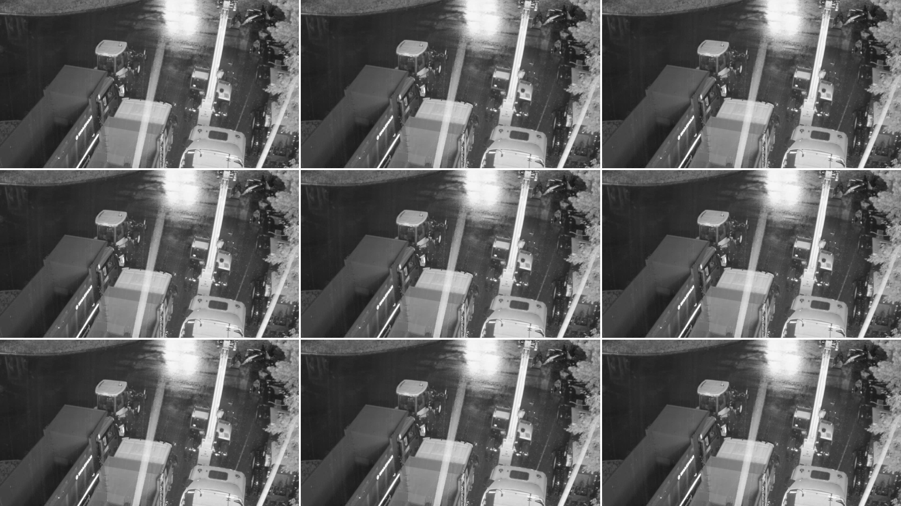

# Livestram broadcaster (Vue, TS, TCSS, Vite, FFMPEG, MediaMTX)

## Флоу работы приложения
rtsp -> ffmpeg -> mediamtx -> front

1. Приходит исходная ссылка (по rtsp) на камеру
2. Через ffmpeg форматируем видео (сжимаем, кодируем, настраиваем) и передаём дальше в mediamtx по `:8554/cam` (см параметры ffmpeg в docker-compose)
3. В mediamtx кушаем полученный rtsp, конвертируем в hls и передаем на фронт по порту `8888`
4. На фронте взаимодействуем с потоком при помощи hls.js и встраиваем в `<video />`

> Пояснение: ffmpeg принимает в себя исходную ссылку и передает rtsp выше - в mediamtx

> Взаимодействие сервисов происходит внутри докер-композа

## Разработка

`docker compose up -d`

## Дока, откуда я черпал инфу

- HLS.js: https://github.com/video-dev/hls.js/blob/master/docs/API.md
- MediaMTX: https://github.com/bluenviron/mediamtx
- ffmpeg: https://ffmpeg.org/ffmpeg-protocols.html#rtsp
- https://www.bannerbear.com/blog/ffmpeg-101-top-10-command-options-you-need-to-know-with-examples/
